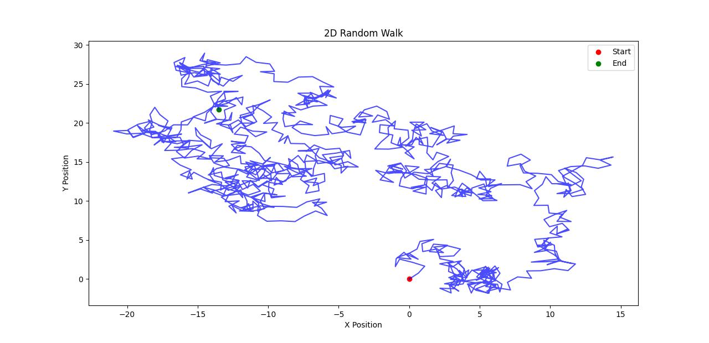

# Random Walk Simulation
Random Walk Simulation 🚶‍♂️🎲
This project simulates a 2D Random Walk using Python. A random walk is a mathematical process where an object takes steps in random directions. It is commonly used in physics, finance, and biology to model real-world random behavior.

How It Works
A walker starts at the origin (0,0).
At each step, the walker moves randomly in one of four directions: up, down, left, or right.
The walk continues for a specified number of steps, and the final path is plotted.
Technologies Used
Python 🐍
NumPy (for numerical calculations)
Matplotlib (for visualization)
How to Run the Code
Install Dependencies:
pip install numpy matplotlib
Run the Script:
python random_walk.py
View the Output: The code will generate a 2D plot showing the path of the random walker.
Example Output:

